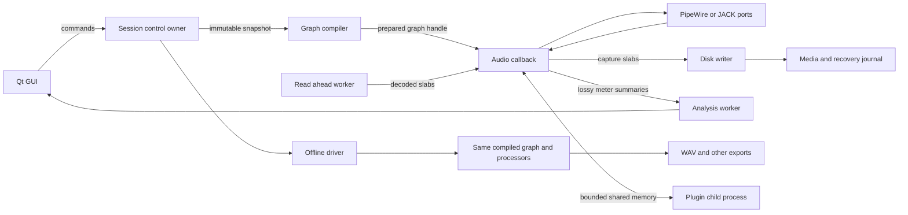

# Architecture, threading and data flow

Status: broad architecture proposed; session/snapshot state, prepared EQ, bounded event queue and single-audio-owner object retirement and S4 capture/disk/journal recovery foundations are implemented. See the [state](09-session-state-contract.md) [engine](11-engine-contract.md) and [recording](13-recording-contract.md) contracts for their exact limits. S5 adds a framework-free audio bridge and Linux native PipeWire foundation with owned-source/monitor/disconnect fixtures. S6a adds bounded read-ahead and private live-EQ playback with worker/seek retirement. The full graph, production playback UI/controller, plugin host and native Windows backend remain staged; see [native audio](14-native-audio-contract.md) and [playback](15-playback-contract.md). Budgets must be measured and versioned.

## Boundaries

The reusable C++ core owns session semantics, processing contracts, timing and graph execution. It includes no Qt classes, device names, GUI handles, `QProcess`, or global audio-route management. The same graph compiler and processors serve live playback and offline rendering. Adapters expose PipeWire/JACK, file rendering and eventually Windows device APIs. Keep the existing PipeWire daemon and its scheduling/session services; do not fork or recreate it.

## Modules

| Module | Responsibility | Allowed dependencies |
|---|---|---|
| `sc::session` | ID-based tracks/clips/takes/automation/tempo/arrangements, command history, migrations | C++/JSON; no device/GUI |
| `sc::engine` | Prepared graph, routing/PDC, voices/events, processor execution, buffer arena | C++/DSP adapters only |
| `sc::media` | Streaming reader/writer, cache, hashes, pool, journal and recovery | libsndfile/SQLite on workers |
| `sc::host` | VST3/CLAP/LV2 lifecycle and IPC ABI | SDK adapters in child; no GUI ownership in engine |
| `sc::analysis` | Waveforms, FFT/loudness/pitch/transients/AI jobs | Workers; dependency-specific adapters |
| `sc::backend` | Port selection and lifecycle, hardware time/latency, device loss | PipeWire first; JACK later |
| `sc::ui` | Qt editors, meters, browser, accessible controls | Immutable read model + asynchronous commands |
| `sc::render` | Offline time driver and export transactions | Same engine; no device backend |

## Thread ownership

| Execution domain | Owns | Prohibited operations / communication |
|---|---|---|
| Qt main thread | Widgets, view state, plugin window integration, user command submission | Never mutates DSP state; never blocks on audio or disk |
| Session control thread | Canonical editable model, command/undo transactions, state validation, port/config requests | Never acquires a callback-held mutex; coalesces GUI gestures |
| Graph preparation thread | Allocation, processor preparation, coefficient tables, layout validation, buffer/latency plan | Never edits an active processor; publishes ready tokens |
| Device RT callback | Active graph state, event application, slab transfer, transport sample cursor | No GUI, disk/network I/O, malloc/free/new/delete, blocking locks, unbounded waits, logging or object destruction |
| Prefaulted DSP workers (later) | Scheduled independent subgraphs using fixed task arrays | No callback dispatch allocations; bounded deadline, no mutex barrier; single callback execution first |
| Disk/read workers | File handles, media IO, durable journal, decoding, read-ahead | Queue transfer; no RT memory ownership races |
| Analysis/index workers | FFT/peaks/loudness, content databases, offline AI | Drop meter work under pressure, never delay capture |
| Plugin children + supervisor | Plugin DSP/main-thread lifecycle, windows, state and scan operations | Deadline-bounded IPC; engine never waits for a dead child |
| Offline render thread | Private graph instance and cursor | May wait for read-ahead/plugins; must not reuse or mutate the live graph |

PipeWire `pw_filter` is preferred for synchronous multitrack ports and server quantum. The S5 adapter uses `PW_FILTER_FLAG_RT_PROCESS`, mapped planar float buffers, an off-RT control loop and audited context/data-loop shutdown. Actual hardware latency and reprepare qualification remain open. Control operations run on a non-RT loop. JACK offers a callback adapter; use the installed JACK server or PipeWire JACK compatibility. Never overwrite the user's default sink as a DAW startup side effect. See [PipeWire filters](https://docs.pipewire.org/group__pw__filter.html) and [JACK callback rules](https://jackaudio.org/api/group__ClientCallbacks.html).

## Bounded communication contracts

Single producer/single consumer per queue. Serialize GUI producers through the session owner; do not assume an MPSC library is RT-safe. Use release/acquire publication, cache-line separation and verified lock-free fixed-width atomics on supported targets. No shared_ptr reference decrement/destructor on RT. Buffers are allocated, page touched and where permitted locked before activation; mlock failure is reported on control thread with a degraded-performance indicator.

| Channel | Initial bound | Full/late behavior |
|---|---|---|
| Control → RT scalar events | 4096 fixed records; each record ≤64 bytes | GUI coalesces continuous gestures by stable ID; capacity preflight reserves note-off/stop slots. Preserve accepted ordered automation, fail/retry unaccepted edits visibly. RT processes ≤1024 events per block; event density exceeding the declared budget stops/flags offline prep, not an unbounded loop. |
| Prepared graph → RT | 2 queued graph tokens | Back-pressure the compiler; do not leak or destroy discarded graph objects on RT |
| RT → retirement owner | 8 fixed tokens, with slot credits reserved before publishing | RT swaps only when a retirement credit exists; otherwise retain old graph. Never free to relieve pressure. |
| Capture RT → disk | Pool sized for **2 seconds**, all armed channels, at declared rate/quantum | Whole sequence-numbered slabs only. On exhaustion latch a dropout timestamp, stop the affected recording cleanly using reserved event space, retain already captured media. Never overwrite unread capture. |
| Disk → playback | 2 seconds read-ahead, separate pool | Underflow emits bounded silence + timestamped gap counter; recording continues unless its own queue fails |
| RT → meter/analysis | 64 summaries + 32 downsampled spectrum slabs | Drop older visualization work; peak/clipping counts separately monotonic; GUI consumes 30–60 Hz |
| MIDI/event ingress | 4096 events/period, reserved note-off/reset capacity | Reject oversized bursts, issue bounded all-notes-off for affected port; identify overload after callback |
| Host IPC | Triple-buffered slabs, fixed event/state descriptors | Sequence mismatch/deadline missed → policy-controlled wet-path silence or latency-aligned bypass; report and restart from last checkpoint |

For 256 channels at 96 kHz, float32 capture alone needs roughly **197 MB** for two seconds. Limits are admission control based on explicit memory budget. [X006](67-track-scalability.md) requires total project tracks to scale with configured resources without a fixed product/license ceiling. The [first implementation](78-resource-admitted-projects.md) replaces the fixed model/parser/mix total-track limit with trusted payload budgets and prepared dynamic replacement masks; the [shared-cache checkpoint](79-shared-media-cache.md) adds bounded file-backed handle/page reuse. These do not qualify sustained throughput or full recording/GUI scaling. The 256-channel Studio cap is not a DAW format ceiling. Version1 targets up to 256 channels per bus with checked graph memory; later limits may grow. Quantum changes exceeding prepared capacity request an orderly reprepare and output silence until ready; never resize in a callback.

## Safe graph replacement and retirement

1. Control makes a validated immutable session snapshot with generation `g`.
2. Compiler creates graph `g` in a separate arena; allocates buffers, delay lines and coefficients; validates cycles, latency limits and port adapters; warms processors off the active path.
3. Reserve retire credits; publish a generation/slot token in a release queue.
4. At a block boundary RT acquires at most one ready graph. Reject stale generations using the control retirement route. Retain the old graph while its processing/tail references are live.
5. Preserve unchanged processor instances through explicit ownership transfer only after the old graph's RT epoch ends. State that must migrate is bounded: small filter histories copy through fixed slots; large delays remain in separately owned nodes. Do not snapshot arbitrary plugin state on RT.
6. Crossfade changed wet paths using preallocated mixers for a declared transition window (default 128 frames). If doubled processing would exceed the admitted budget, transition a bounded subgraph or perform a visible stopped reconfiguration. Transport and recording state do not reset accidentally.
7. Retirement worker destroys old objects only after callbacks and any DSP jobs acknowledge the retired epoch. Shutdown stops device callbacks first, drains worker epochs, then frees pools.

An atomic pointer swap alone is insufficient: object lifetime, old tails, graph buffers, worker readers and plugin children must be accounted for. The existing Studio `configure()` requires stopped processing; wrapper preparation therefore creates a distinct instance. Ordinary scalar changes are delivered to the audio owner. Full coefficient/profile changes need a prepared replacement and smoothing; existing scalar immediacy does not prove click-free automation.

## Processing contract

`prepare(sampleRate, maxFrames, layout, mode)` runs off RT. `process(ProcessContext&, AudioBusView, EventSpan) noexcept` uses caller-owned planar float32 buffers and bounded scratch. Internal summing may use float64 where tested; keep overs above 0 dBFS through the mix graph. Clamp only a deliberate protection/output stage. A DAW EQ wrapper must remove/bypass Studio's forced output clipping and automatic headroom behavior under a tested adapter or a separately maintained GPL DSP module; never change the premium EQ during this task.

Processor metadata includes stable type/version/instance IDs, port layouts, parameter descriptor IDs, latency in samples, maximum tail (`finite`, `until-silent`, or `infinite`), in-place permissions, silence handling, determinism/seed, offline support and thread requirements. Sample-offset events order by timestamp then stable ingress sequence. Partition at event offsets when an API lacks sample-accurate events; reject densities exceeding prepared scratch. Latency changes signal control to recompile PDC; until prepared, use a documented bounded fallback rather than unsafe delay-line resizing.

Graph compiler sorts a DAG, allocates reused buffers by lifetimes, and explicitly breaks permitted feedback loops with ≥1 sample/block delay nodes. Undeclared zero-delay cycles fail validation. Compute cumulative latency across main and sidechain paths, insert alignment delays at joins, and propagate through sends/buses/containers/plugin IPC. Monitoring policy may bypass high-latency processors, but saved/rendered state stays intact. External inserts use measured round-trip latency and real-time export only; offline export must offer skip or cached print with a visible warning. Rendering includes tails, preroll, automation, deterministic seeds and the identical routing graph.

Plugin IPC defaults to a one-quantum pipeline: callback submits block N and consumes the ready, matching sequence for block N-1. It checks readiness once and never spins or waits. Missing output invokes the declared latency-aligned fallback and latches a supervisor error. Changes in quantum rebuild the pipeline/PDC off RT. Offline rendering may wait for child completion and then trims the explicitly reported pipeline delay; plugin offline mode can legitimately alter sonic behavior, which requires separate fixtures rather than a blanket null-test claim.

## Timing domains

- **Device frame clock**: monotonic per device generation; supplied by PipeWire/JACK along with capture/playback latency. Device restart creates a new generation.
- **Engine frame clock**: signed 64-bit project-rate frames. Scheduling/recording alignment use exact integer sample offsets; track timestamp origin and capture latency separately. Store raw recording timestamps before applying user offsets.
- **Musical time**: rational beat positions or fixed ticks (960,000 ticks/quarter); compiled immutable piecewise tempo/signature map converts to frames with specified rounding. Tempo ramps integrate analytically/numerically with bounded precomputed segments. Tests require ≤1 frame error.
- **Wall time**: monotonic clock for UI/supervision; never authoritative for sample scheduling. File timestamps are metadata.
- **Video/timecode**: rational frame rates, explicit drop-frame rules, SMPTE offsets; MTC/LTC/clock synchronization maps to engine time without rounding the audio clock to video frames.

Independent device clocks need explicit resampling/drift tracking on prepared adapters; do not aggregate two interfaces by assuming they run at identical rates. JACK/PipeWire transport synchronization is an adapter to the project clock, not the session state owner. Launcher transitions, loop/punch boundaries and performance capture are sample-timestamped in engine time with musical quantization from the same map.

## Channel and parameter identity

Layouts carry channel count **and meaning**: mono/stereo, named speaker positions, discrete numbered channels, or Ambisonics order/ACN ordering/SN3D-N3D normalization. Preserve FuMa conversion explicitly, never relabel without conversion. All sidechains and channel maps have their own layout. Downmix/upmix uses an explicit user-visible matrix and normalization; no implicit stereo truncation. Store port symbolic identity separately from transient device object IDs.

Session objects use immutable UUIDs. Parameters use processor-type UUID + stable symbolic parameter ID + instance UUID; band ID survives reorder and frequency change. Units, ranges, interpolation/smoothing and schema version are descriptors. Plugin native parameter IDs are namespaced by format/vendor/class ID; mappings retain unknown IDs. Preset application is one undo transaction, never an index-dependent replacement of all user identities. Automation and modulation combine through an explicit order (base → automation → modulation → safety bounds), with voice scope and note identity.

## Project durability and defensive boundaries

Project directory: `project.json`, `media/`, `states/`, `recovery/`, `backups/`. JSON is versioned (`format`, `schemaMajor`, `schemaMinor`, creator build, IDs, tempo, routes, assets, edits, parameters). Opaque plugin state blobs have format/version/length/hash metadata and independent bounded limits. Media uses project-relative paths + content hashes, original names and source format/layout, not absolute-only paths. Unknown plugin nodes preserve full state/routes/automation and offer missing-plugin placeholders. Missing-media search is user initiated with hash verification; never silently substitute a same-named file.

Save snapshots on control thread, write temp files on disk worker, flush files and project directory, then atomic rename on the same filesystem. Keep last valid generation, backup rotation and per-recording journal; autosave never deletes media to enforce count limits. Command undo stores semantic inverse transactions/reference IDs, not entire audio buffers. Migrations transform copies, validate and keep original; newer unknown versions open read-only or fail clearly. Undo is not a backup strategy.

Recording writer appends sequence-checked slabs and periodically commits durable frame extent (target 1 second). RF64/BW64 or bounded segments avoid the RIFF 4 GiB limit. Recovery scans journals, validates actual media extent, finalizes headers and offers recovered takes with explicit gaps. Crash/power-loss durability depends on the filesystem and storage flush behavior; acceptance must distinguish process kill from power loss.

Plugins and imported projects are untrusted inputs. Validate sizes/counts/paths/UTF-8; reject traversal and expansion bombs before loading assets. Discovery runs in timeout-limited children, without root privileges or shell command construction. Plugin process separation initially contains crashes; it is **not automatically a security sandbox**. Add optional Linux namespaces/seccomp/filesystem grants only after compatibility tests. No upload of sessions or background download of code/models. Publish an SBOM and notices for actual release builds. Bounded parser fuzzing, fault injection and malformed fixtures are defensive tests in later gates.

## Monitor versus print paths

Master/track exports branch before control-room correction, monitor gain, dim, talkback and headphone transforms. Cue buses are distinct routes. Store monitor calibration globally with device/profile version, and make printing a correction an explicit export choice that defaults off. Imported EQ speaker profiles are approximations from measurements, not proof of room correction. Analysis must not feed GUI repaint rates back into sample processing.

## M2b desktop identity checkpoint

[Selected-track timeline](30-desktop-timeline.md) keeps canonical project order
separate from transient selection. Existing single-track owners receive cached
control-side projections and accepted-prefix preparation with a captured ID.
Follow reconciliation uses that ID; selecting or editing a different track does
not retarget audio. This does not implement the multitrack DAG, PDC or shared
playback/capture clock described above. M2c supplies those engine foundations;
Qt scene allocation, parameter formatting and model projection stay outside RT.

## M2c1 shared-clock mix checkpoint

[The new core](31-multitrack-mix.md) prepares independent track EQ/event nodes,
explicit sparse channel matrices, float64 sum scratch and one sample cursor.
Per-track read-ahead pipes retain healthy offsets during counted gaps/late data;
one fair disk owner remains outside callbacks. Static track/mix WAV export shares
this processing path and the existing publication transaction. Production native
playback/Qt integration is next; general DAG/PDC/feedback/crossfade/state migration
and simultaneous capture/overdub remain required. No new dependency is adopted.

M2c2: [native shared-clock mix playback](32-native-mix-playback.md) now uses the same prepared run as offline mixing. The clock bridge dispatches through preparation-fixed pointers; model reconciliation resolves UUIDs and requires receipts from every affected lane. GUI/disk/preparation/retirement remain off RT. Matching-layout desktop mixes retain an explicit output anchor; dedicated master state/matrix UI and shared multitrack capture are required next.

M2c3 adds [versioned plain master state](33-master-matrix.md): stable bus ID, sparse channel matrix and independent endpoint intent. Compilation/persistence/GUI/history remain outside RT; prepared playback retains immutable copies.

M2c4 adds [immutable first callback validation facts](34-native-timing.md), published independently of lossy observations and copied before endpoint retirement. Bounded test-only wall-time measurement is inspected after native join. Production callbacks add no timing acquisition/logging/allocation. First winning terminal status, silent invalid-buffer refusal and the unchanged engine cursor remain authoritative.

M2d1 adds [one admitted device clock for playback and armed raw capture](35-shared-playback-capture.md). Raw publication precedes optional live-input staging through the existing EQ/matrix run. File offsets and underflow reporting remain explicit. Prepared per-track pipes share one origin and preserve accepted/rejected prefixes; writer/pool failure stops the whole generation without inventing a common length. The [M2d2 ownership layer](36-duplex-recording-owner.md) now preflights combined capture payload before pool allocation, owns activation-time writers, joins native callbacks before disk finalization, retires joined disk owners and retains each take/error plus the reader error independently. [M2d3 desktop recording](37-desktop-duplex-recording.md) now captures full accepted-prefix arms/range, binds explicit stable track/local input and master output routes, waits for every participating lane receipt, and hands joined successful receipts to one atomic off-thread verification/history transaction. Native joins and group verification precede active Save/close. Declared duration/load/native Windows and full graph workflows remain open.

M2d4a adds [paced synthetic duration/recovery qualification](38-recording-duration.md)
without changing production ownership/DSP. Generation, independent raw/output
checks, wall pacing, supervision and media hashes stay outside the audited
callback. Lateness of the private producer is reported separately from contiguous
sample correctness. A successful ten-minute private-clock run does not qualify
native 30-minute deadlines, physical alignment or Windows runtime.

M2d4b adds [native route admission and full-duration diagnostics](39-native-duration-qualification.md).
Selected link listeners are control-owned; native activation negotiates buffers
while a release/acquire admission gate silences certified outputs without
advancing DSP/capture/origin. Engine admission waits for every selected link to
be Active; bounded timeout rolls back, and later inactivity retains DeviceLost.
An optional clock observer supports fixture-only current-period audit coverage,
including gated/shutdown callbacks. Timing storage is fixed before activation;
quantile sorting and worker-boundary diagnostics happen after join. Streaming
raw/output verification bounds memory. The first long run's pool exhaustion and
the subsequent120-second maximum callback-budget miss remain open. Existing
capture pools, budgets, durability and RT processing algorithms are unchanged.

M2d4c1 adds [optional disk-owner phase/backlog observation](40-writer-backlog-diagnostics.md).
The observer reads existing ready-queue publication counters and its own acquired
packet; the producer's partial slab is omitted and final ready-frame extents are
upper bounds. Audio `push()`/`finish()` acquire no additional diagnostic counters,
clocks or locks. Writer-only paired write/hash, flush, journal and idle observations
retain written/durable cursors. Construction has no producer backlog. Fixed
fixture maxima/context and the callback maximum's clock/start time are inspected
after joins; they distinguish declared phase wall time from presumed disk or
scheduler causes. The fixed capture/durable checkpoint policy is preserved while
the native failure remains under investigation.

M2d4c2 adds [admitted capture reserve and first checkpoint phases](41-checkpoint-burst-policy.md)
([ADR-031](decisions/031-admitted-capture-reserve-and-checkpoint-phases.md)). Capture
admission rounds whole independent pool slots up to the requested duration within
fixed token/per-pipe/aggregate bounds; playback blocks and queues stay separate.
Prepare captures the desktop choice, and only armed pools are admitted. Initial
checkpoint phases disperse nominal disk calls without increasing regular frame
spacing. Block quantization, scheduling and backlog limit phase separation; stalled
durability has no hard wall-time guarantee. Scoped native stall absorption/exhaustion,32-track copy recovery and120-second
full sample/timing gates now pass. Required30-minute native timing/throughput and
every independent reliability/platform/physical/product gap remain open.

M2d4c3 adds [supplemental native fixture CPU timing](42-native-callback-cpu-diagnostics.md)
after the post-reserve1800-second attempt stops around196seconds on a skipped sink
cycle. Diskqueues max1 and all retained raw/common-output samples are exact; owner
max wall20.768787ms fails the existingperiod budget. Optional thread CPU clocks and
fixed coverage/maxima supplement, never replace, full elapsed/current-period gates.
Full sink/max-clock flags are printed after joins. Production remains unchanged;
short CPU coverage does not establish original cause or long native qualification.
