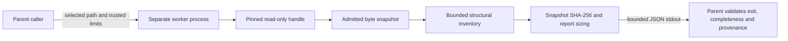

# X004: separate-process inspection worker and bounded report

Date: 2026-10-08. Native-project conversion/compatibility: **unqualified**.

`sc-import-inspect-worker --rpp SELECTED_FILE` now reads a selected plain file,
inspects the accepted RPP structural subset and streams a versioned JSON report
to stdout. This is a developer inspection tool; the desktop import action and
transactional conversion are not yet integrated. No original/destination file is
written. No referenced media, plugin, embedded script or program is opened.

The current parent is the acceptance harness. A product Qt controller must still
reserve host-wide memory for the child/response, validate the protocol, impose an
external deadline and integrate cancellation without blocking the GUI/audio
threads. The worker's ledger is process local, not shared accounting across the
whole application. OS access sandboxing and hard process memory limits are not
qualified; a process boundary alone does not supply those controls.

## Read and memory contract

Acquire one pinned read-only handle and reject directories, special files and
final-component symlink/reparse files before reading. Linux opens nonblocking to
avoid a FIFO-open hang, then checks the descriptor type. Windows denies writer
sharing and checks disk/reparse attributes. An explicitly selected path's parent
directories may resolve through links; foreign path tokens are never traversed.
Network/slow-device acquisition still needs the parent's external deadline.
The Windows flags/handle checks follow Microsoft's
[CreateFileW sharing and reparse semantics](https://learn.microsoft.com/en-us/windows/win32/api/fileapi/nf-fileapi-createfilew),
[file-type API](https://learn.microsoft.com/en-us/windows/win32/api/fileapi/nf-fileapi-getfiletype)
and [handle information API](https://learn.microsoft.com/en-us/windows/win32/api/fileapi/nf-fileapi-getfileinformationbyhandle).

Check initial size, read in at most 64 KiB chunks with cancellation, require the
expected byte extent and EOF, and recheck size/mtime on the same handle. These are
consistency checks, not an atomic filesystem snapshot guarantee. Report SHA-256
identifies the bytes actually retained. Before conversion, a parent must capture
and persist those exact bytes or revalidate the hash; a report is not a persistent
opaque-state archive or permission to reopen foreign dependencies.

Admit read staging and its later independent document together; retire staging
before hashing. Reserve bounded crypto/report banks. Existing BCrypt/Windows and
OpenSSL/Linux SHA-256 providers are used; no new dependency or algorithm is
introduced. Provider/runtime/thread/allocator overhead is outside payload
accounting, so the default 64 MiB ledger is not a hard process RSS ceiling.

Default report limit is 64 MiB; input/line/depth limits follow checkpoint 113.
Trusted caller flags can set `--memory-bytes`, `--maximum-input-bytes` and
`--maximum-report-bytes`. A counting pass refuses excessive output before stdout
publication. Rows use a fixed 2 KiB bank and never interpolate foreign strings.
The next pass streams rows; interrupted/failed output must be rejected even if
some bytes reached the parent.

## `sc-import-inspection-v1` protocol

| Field | Meaning / acceptance contract |
|---|---|
| `protocol`, `adapter` | Exact versioned identifiers; unsupported versions require explicit refusal/migration. |
| `sourceFormat` | Structural RPP candidate, not a qualified source-suite version envelope. |
| `workerPid` | Actual child PID; parent retains actual process handle and exit. |
| `source.bytes`, `source.sha256` | Exact captured byte count and SHA-256; consumer matches its owned snapshot. |
| `source.storage`, `source.consistency` | Worker-memory snapshot; size/mtime checks do not claim atomicity or persistent source delivery. |
| `nativeCompatibility`, `semanticStatus` | `unqualified` and `unverified`; structural success never promotes them. |
| `writerVersion` | Unverified root-header range, without interpreting a token as a qualified writer version. |
| `root`, `nodes` | Structural indices, parent, line/key/extent ranges. Every range is `[byteOffset, byteLength]` into the identified snapshot. |
| Each node's `status`, `originalBytesRetained` | Semantics unverified; bytes remain in the worker snapshot. Parent must persist exact source before treating these ranges as recoverable opaque state. |
| `complete` | Final success footer; parent additionally requires actual exit 0, bounded complete JSON, valid schema/ranges and matching provenance. |

Errors go to stderr as incomplete protocol messages with stable localization
IDs: `import.invalid_request`, `import.invalid_structure`, `import.resource_limit`,
`import.io_error`, `import.canceled`, `import.worker_failure`. Foreign text/paths
are not echoed. Human explanations/translations belong to the future GUI adapter;
no new supported-language claim is made.

Exit 0 means complete structural inspection only. Exit 1 is refusal/failure;
exit 3 is cooperative cancellation. POSIX SIGINT/SIGTERM use a lock-free flag and
off-signal stop source. Broken stdout pipes become checked I/O refusals. OS-forced
Windows termination has its actual observed exit, not a synthetic cooperative
result. Blocking I/O/report backpressure still requires parent-driven draining,
deadline and safe child retirement.

## Verification and next task

Real child-process tests verify PID boundary, exact independent Python SHA-256,
Unicode paths, arbitrary opaque bytes, full structural ranges, untouched source,
bounded input/memory/report refusals, malformed/truncated input, missing files,
directories, Linux links/FIFO/device refusal, closed pipe and live cancellation.
Linux Release and ASan/UBSan pass; Windows MinGW builds. Hosted MSVC execution of
this worker is queued, not yet claimed. The earlier structural library has nine
hosted native unit/synthetic tests passing at `2f81b97`, including 174 structural
checks; its exact log is retained separately.

Local evidence: [worker receipt](../tests/results/X004/2026-10-08-import-worker.json).
The acceptance parent's bounded first-byte wait is recorded in a separate
[follow-up receipt](../tests/results/X004/2026-10-08-import-worker-parent-deadline.json);
the prior input hashes and exits remain unchanged in their original receipt.
Earlier hosted evidence: [RPP structural receipt](../tests/results/X004/2026-10-08-hosted-rpp-structure/receipt.json).
No local VM/audio endpoint is needed. Existing end-user previews are unchanged.

Next: implement a Qt parent controller with admitted response buffers, strict
validation/deadline/cancel retirement and a read-only inspection/loss preview;
persist exact opaque source with provenance under an approved new import bundle.
Then create rights-cleared projects in a pinned source-suite version and map the
first track/clip subset into versioned import intermediate state. The full
Bitwig/Cubase/other native import program, conversion and editing/render fidelity
remain required. This tool does not replace them with a structural inventory.
