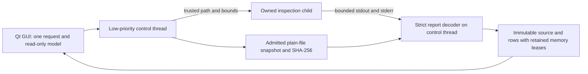

# X004: desktop foreign-project inspection preview

Date: 2026-10-08. Frozen baseline SC-DAW-BASELINE-2026-10-05 remains unchanged.
Native compatibility and conversion remain **unqualified**.

The File menu now offers **Inspect foreign project…**. Select a REAPER `.rpp`
file to see its structural outline, line numbers and explicitly unverified
properties. This preview preserves the current session, command history and
original file. It does not create tracks, resolve media or open plugins/scripts.
Conversion, a persistent import bundle and the other required native/exchange
adapters remain in [X004](10-project-import.md).

## Ownership and threading

The controller admits one request. A second request reports Full; shutdown and
cancel bypass that admission. File reads, hashing, process waits and JSON decoding
run outside GUI/audio callbacks. The GUI polls immutable snapshots every 20 ms
and uses a virtual table rather than a widget per source line. Header measurement
is limited to 64 rows. The installed sibling helper is addressed by absolute path,
without a shell or PATH lookup. Foreign content cannot choose executables.

Both processes acquire checked read-only plain-file handles. The parent retains
its own exact source bytes and hash. A shared application ledger reserves the
child payload allowance, response bank, decoder allowance and row bank before
spawn. Response capacity follows the input line count, configured maximum and
remaining resource allowance. Source/row leases survive controller destruction
while any result borrower still owns them.

Default input is at most 16 MiB; structural limits remain 200,000 lines and
128 nesting levels. The child deadline is 20 seconds. Channels are drained on
the worker thread into bounded banks. Cancel/deadline sends termination, then
kill after 200 ms if needed. Flooding kills immediately. The exact process owner,
banks and payload allowance remain alive until NotRunning confirms termination;
a wait timeout is not interpreted as a completed child. Actual PID/exit are
retained, and failed start never invents them. Closing the dialog/window requests
shutdown and waits through GUI polling for retirement.

## Report acceptance

Exit 0 is necessary but insufficient. Acceptance verifies the exact protocol and
adapter identifiers, actual PID, source byte count/SHA-256, complete footer,
unqualified/unverified flags, expected row count and exact keys. ASCII token and
depth preflight precedes DOM parsing. Duplicate keys, malformed/deep JSON,
unknown fields, invalid integers, out-of-bounds ranges, invalid parent hierarchy,
incorrect LF line boundaries, block extents and root/header mismatch are refused.
The parent validates byte inventory; it does not parse foreign project semantics.
No result receives a converted/verified status from structural success.

Foreign keys are shown as plain table text, capped at 120 bytes. Paths and notices
use plain-text labels. No arbitrary foreign values are displayed as rich text.
Source snapshots remain memory-only. Later transactional conversion must persist
the source/provenance and loss evidence before applying an approved change.

## Packaging and localization

CMake installs the helper beside the application. New Linux package preparation
requires its tested executable hash and rejects missing/stale helper payloads.
New Windows preparation requires a matching source commit, actual native worker
PID/exit and helper executable hash, independently from pinned third-party DLLs.
These checks do not qualify a new installer: existing preview binaries are unchanged.

New controls, statuses, errors, columns and plural counts are extracted into the
DAW catalogs. Line numbers follow QLocale; RTL layout is exercised. There are
34 partial/source catalogs and 596 contextual source keys, with no new language
coverage, native-speaker review or full UI qualification claim. The all-Europe
inventory and review requirements remain open.

## Evidence and limitations

The prior worker's exact hosted Windows revision passed 129 real process checks,
174 structural checks and ten selected tests from 41 configured tests. Its
[retained receipt](../tests/results/X004/2026-10-08-hosted-import-worker/receipt.json)
is separate from this new Qt controller/dialog. No local VM or endpoint was used.

Current Linux tests exercise a real child with Unicode source paths, strict report
refusals, failure to start, exhausted budget, retained borrowers, single-flight
admission, cancellation before/during execution, stubborn deadline termination
and response flooding. The desktop test exercises the File action, read-only
model, no canonical-session/revision/history mutation, display fit, locale/RTL,
busy-close retirement and unchanged original bytes. See the accompanying dated
[receipt](../tests/results/X004/2026-10-08-desktop-inspection/receipt.json) for exact source/binary hashes, build scopes and observed exits.
The initial sanitizer GUI failure is retained: a minimal Qt typed-signal probe
fails with the old `-fno-pie` compilation and succeeds with `-fPIC`. Rebuilding
with `-fPIC` and `-no-pie` executable linking passes all three affected tests;
ASan/UBSan runs disable leak detection, so no leak-sanitizer claim is made.

Payload admission is not an exact RSS ceiling: Qt/process/provider/runtime and
allocator overhead remain outside it. Hard OS memory limits and access sandboxing
are not yet qualified. Parent storage acquisition/read is cancelable between
chunks, but a blocking disk/network syscall can delay shutdown; the child deadline
does not impose a hard deadline on parent disk I/O. Same-handle size/mtime checks
are not an atomic snapshot guarantee. Current Windows Qt controller/dialog
execution and new installed Linux/Windows payload workflows remain pending.

## Next implementation task

Add a bounded, versioned inspection bundle writer on the I/O worker that persists
the exact source bytes, source hash, original structural ranges and unverified
property states into an owned new destination. Test interrupted writes, refusal
of existing destinations, relocation, reopen and missing source. Then establish a
rights-cleared corpus from a pinned REAPER writer and implement the first track/
clip semantic subset with per-property preservation/loss evidence and explicit
preview before a single undoable conversion transaction. Keep Bitwig/Cubase and
other required adapter/version work visible.
