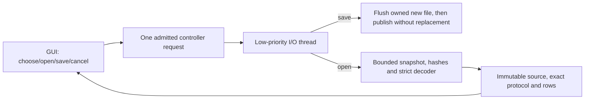

# X004: portable saved inspection bundles

Date: 2026-10-08 (local). Frozen baseline SC-DAW-BASELINE-2026-10-05 remains unchanged.
Native project conversion and compatibility remain **unqualified**.

The inspection dialog now offers **Save inspection…** and **Open inspection…**.
A `.scinspect` file contains the exact selected source bytes and the validated,
explicitly unverified structural outline. It can be moved and reopened without
the original source file or a running REAPER installation. Saving does not add
tracks, alter the current session/Undo history, or resolve foreign media/plugins.
Choose a new destination: existing files, links and directories are preserved.

## Container and acceptance contract

The framework-independent v1 container is uncompressed and length-delimited:

| Offset/section | Representation |
|---|---|
| 0–7 | ASCII `SCIBND01`, exact container version |
| 8–15 | Little-endian unsigned 64-bit source byte count |
| 16–23 | Little-endian unsigned 64-bit protocol byte count |
| 24–31 | Little-endian unsigned 64-bit originating worker PID |
| Source | Exact opaque original bytes, including CRLF and invalid UTF-8 |
| Protocol | Exact accepted ASCII `sc-import-inspection-v1` report |
| Footer | 64 ASCII hex characters: SHA-256 of the protocol |

The protocol includes the source SHA-256, byte count, structural ranges and
unverified statuses. Reopen checks the complete extent, configured limits,
protocol checksum, independently copied/hashed source and the strict decoder
from checkpoint 115. Unsupported versions, truncated/trailing bytes, inconsistent
fields and invalid reports are refused. No foreign grammar is reparsed in the
parent. The recorded PID is historical provenance, **not a new process receipt**.
Checksums detect corruption; they do not authenticate an author or source suite.
Rewriting a bundle and its checksums cannot promote semantic compatibility.

Default envelopes remain 16 MiB source and 64 MiB protocol, subject to shared
memory admission. The source, exact encoded bank and decoded rows keep their
leases for the complete immutable-result lifetime. Reopen also admits the input
container, copied source, decoder allowance (32 times encoded bytes plus 32 KiB),
row storage and crypto work before those allocations. Transient container/decoder
banks retire after validation. Large files can be refused well below format
limits when the shared application budget is insufficient; this is not a hard
RSS ceiling. No compression/archive or new third-party dependency was added.

## Threading and publication

One admission covers inspect, open and save. The dialog disables competing
controls while busy. File I/O, hashes and decode run off GUI/audio threads. Save
borrows the immutable report; failure/cancellation leaves it available for retry.
Close requests cooperative cancellation and polls retirement before destroying
owners. Reopening uses no child executable and never invents active PID/exit
fields. Cancel is checked between chunks and before publication; cancellation
arriving after publication does not roll back a successful new file. Blocking
filesystem calls can still delay shutdown, as recorded for the source loader.

On Linux, an anonymous `O_TMPFILE` is written/flushed, then published through its
owned descriptor into a pinned destination-directory handle. The `linkat` call
preserves existing destinations. Parent `fsync` success is distinguished from
file-only durability. Filesystems without anonymous temporaries/hard links, or
without the required procfs access, are refused; a portable safe fallback remains
a delivery gate. This implementation follows the [Linux link API](https://man7.org/linux/man-pages/man2/link.2.html).

On Windows, a unique new temporary is kept through an exclusive owned handle.
The file is flushed and published relative to the selected directory with
replacement disabled. The initial hosted Win32 `FileRenameInfo` relative-root
call failed on its first new-file publication; the failed native log is retained.
The follow-up uses the documented native `NtSetInformationFile` relative-root
contract, resolving the function from the already-loaded Windows `ntdll` module.
It opens the directory for traverse/read-attributes and keeps the synchronous
file handle/buffer through completion. No mutable absolute destination fallback
or DLL path search is used. Failure cleanup still marks the owned file for
deletion by handle. Device names, streams and trailing-dot/space names are
refused. Windows reports file-flushed durability, not directory-flushed power-loss
protection. See Microsoft's [native rename structure](https://learn.microsoft.com/en-us/windows-hardware/drivers/ddi/ntifs/ns-ntifs-_file_rename_information)
and [native information API](https://learn.microsoft.com/en-us/windows-hardware/drivers/ddi/ntifs/nf-ntifs-ntsetinformationfile).
The narrow OS API choice and remaining SDK/platform qualification costs are in
ADR083. Follow-up native execution remains pending independently of cross-build.

## Evidence and open gates

The [local receipt](../tests/results/X004/2026-10-08-inspection-bundle/receipt.json)
records exact input/binary hashes and actual test exits. Synthetic library tests
cover opaque byte round trips, Unicode paths, relocation, historical PID/ranges,
corrupt fields/contents/footer, truncation/trailing bytes, budget/scope refusal,
existing destination preservation, injected interrupted writes, after-flush
cancellation, concurrent destination creation and credit retirement. Linux final
symlink targets are preserved/refused. Controller/UI tests use a real inspection
child, save/reopen with the original source temporarily absent, keep unverified
statuses, preserve existing bundles and retire cancellation/close owners.

PR #58 merged after all required checks passed. Its exact prior revision
`e391ee9` passed 74 Linux synthetic/offscreen tests and ten selected native MSVC
tests (41 configured), including 129 actual worker-process checks. That
[hosted receipt](../tests/results/X004/2026-10-08-hosted-desktop-inspection/receipt.json)
qualifies the earlier controller/package revision only; it excludes this bundle
change, Windows Qt execution, installed previews and audio endpoints.

The first hosted bundle revision `6804e48` compiled with MSVC but failed its
new-file publication check; ten other selected tests passed (42 configured).
The [failed native artifact](../tests/results/X004/2026-10-08-inspection-bundle/initial-windows-ctest.zip)
and metadata are retained. A follow-up native-only probe records the original
Win32 call's actual error without treating it as an accepted fallback. No test
oracle is relaxed; the complete bundle suite must pass with the corrected API.

New strings are extracted into 34 partial/source catalogs with 606 contextual
keys. Draft translations remain 3,135; no native-speaker or full UI qualification
is promoted. The all-Europe language register remains required.

Actual process death/power loss, disk-full/device failure, adversarial directory
replacement, Windows cleanup-failure/crash remnants, cross-platform transfer,
network/removable-filesystem support, Windows Qt Save/Open execution, hard OS
memory/access sandboxing and refreshed installed packages remain open. Existing
end-user installers are unchanged; no local VM or audio endpoint was activated.
The full functional, quality, bundled-content and native compatibility goals
remain incomplete.

## Next implementation task

Establish a rights-cleared project corpus from an exact pinned REAPER writer.
Specify the first track/clip semantic subset and build an import intermediate
representation with per-property preservation/loss evidence, retained opaque
state and unresolved media/plugin placeholders. Preview before an explicit new
project conversion transaction; verify source preservation, cancellation, Undo,
reopen and render alignment independently on Linux and Windows. Complete the
bundle platform/filesystem/install gates alongside that work. Bitwig/Cubase and
the other registered native/exchange adapters remain required.
