# Background stretch supervision and guarded project adoption

2026-10-09. This checkpoint implements the Qt control component, canonical
project-command boundary, and selected-clip pitch/stretch dialog. SC-DAW-BASELINE-2026-10-05 and all F/Q/C/N gates
remain unchanged.

## Control and data flow

```mermaid
flowchart LR
    Caller[Desktop caller] -->|one admitted selection| Control[Qt control worker]
    Control -->|bounded request and verified ready/start| Child[Contained offline renderer]
    Child -->|owned RF64 and completion marker| Verify[Pinned artifact verifier]
    Verify -->|owned typed result| Queue[Canonical project command queue]
    Queue -->|epoch/root/ID and stale clip checks| History[One structural edit and Undo]
```

The controller owns one queued/active operation. Published selections and snapshots
are immutable; preparation publishes a new selection rather than modifying an old
GUI-held object. Input paths, process launch, hashing, marker publication and output
verification stay on its control thread. No renderer or filesystem work runs in an
audio callback or in the caller's event loop.

Source byte admission opens and pins the original input before child launch. The
whole OS process-memory ceiling is reserved from the caller's aggregate ledger
before spawning and retained through reaping. Parent codec/channel work has its
own allowances. Failed memory/source-byte admission starts no child. The parent
creates only the plain owned media/derived namespace after admission and preserves
all existing operation directories. Caller-selected roots never come from a
foreign project token.

Ready identity must match the prepared source/settings. The parent acknowledges
start only before its deadline and before cancellation. Cancel publishes an owned
token where possible, terminates, escalates to kill after 200 ms and reaps. A
separate child watchdog covers opaque vendor work. Channel overflow stops the
child. QProcess implementation work is covered by a conservative allowance;
declared payload credits are not an exact allocator/RSS ceiling for the parent.

After reaping, inspect the owned completion marker even after canceled, timed-out
or abnormal outcomes. A valid completed artifact remains available with those
flags for explicit review; canceled output must not be auto-attached. Unverified
outcomes retain a recovery-required operation and create no Session edit. There
is no automatic orphan cleanup, interrupted-render recovery UI or cache reuse yet.
OS filesystem cancellation/deadlines remain cooperative; blocked OS I/O is not
bounded by the parent stopwatch. Shutdown is requested asynchronously, and keeps
the terminal outcome visible when the worker closes.

## Canonical adoption guard

Desktop structural adoption retains the typed verifier result and its ledger
credit through queue consumption. The canonical controller requires ownership by
its ledger, the exact project epoch, root and project ID, and the result's expected
clip/raw identities. It refuses an unchecked ApplyClipStretch payload. Separate
correlated success/rejection receipts distinguish this operation from unrelated
errors or recording attachment. Preflight occurs before gesture/history mutation.

Reopening the same project changes its epoch: identical root, project and clip IDs
do not authorize attaching an old asynchronous result. Unrelated edits can survive
when the expected clip/raw identities still match. Valid adoption is one Undo/Redo
transaction; stale or resource-rejected results leave canonical state unchanged.

## Desktop workflow

Select an audio clip and choose **Pitch and stretch…**. Duration uses an exact
integer numerator/denominator (0.25–4 times the retained original span); pitch
uses semitones independently (±24, in 0.00001-semitone increments). Formant
preservation is explicit. Unfocused mouse-wheel input does not change numeric
controls. Linked playback speed is a separate control.

Render is nonmodal and leaves the project unchanged. The review names the exact
settings of the verified artifact even if the next render settings have changed.
Apply submits one guarded, correlated, undoable structural edit; it is not inferred
from queue admission. Completed canceled/abnormal outcomes use an explicit reviewed
Apply label. No automatic adoption occurs. Closing the dialog leaves the job in the
background; quitting requests cancellation and waits for reaping and any submitted
adoption receipt before the normal project-close barrier. Reopening a project
disables the previous dialog/result. A rejected adoption retains the owned files
and reports that a fresh render is needed.

Native Windows qualification and preview deployment remain pending. The CMake
installation includes the sibling helper and its license. Existing preview
packagers need matching helper payload/provenance/qualification updates before
this source is distributed as an installer. No preview was packaged or released.

## Current evidence and next task

Local Release controller and UI tests pass, including 48 controller and 45 UI
workflow checks with an
actual owned render. They cover whole-child credit before spawn and release after
reap, immutable held snapshots, busy/closed admission, cancel before spawn and after
ready, valid completion inspection after an ambiguous/canceled post-exit outcome,
memory/source-byte refusal, active shutdown, a deadline with a responsive main event
loop, actual canonical attachment/Undo, stale clip rejection, foreign-credit refusal
and same-project reopen rejection. These are synthetic media/control workflows,
The controller checks do not open native audio; the separate UI checks exercise
the real application window.

The preceding [core checkpoint](135-editable-stretch-state.md) passed protected
Linux106/native Windows core40/Windows Qt10 plus cross-build, and merged as77fc547.
Its receipt binds source783aa0c; it does not qualify this new supervision component.
Current local evidence is retained in [the qualification receipt](../tests/results/M2/2026-10-09-stretch-supervision/qualification.json): all 112 Release tests, 48 supervisor/45 UI checks under AddressSanitizer and UndefinedBehaviorSanitizer with leak detection, and the 47-check screenshot run. The actual child in sanitizer workflows was the Release helper; no instrumented-child runtime is claimed. Source and executable hashes, raw logs, and exact pre-fix regression sources are retained. Current native Windows qualification is pending.

Next qualify the completed window workflow on native Windows, update preview
helper deployment and its exact qualification receipts, and refresh installed
previews. Very short span context, dynamic warp, segmented pitch,
phase/formant/transient quality and the full frozen-reference scope remain required.

The actual application-window test uses an owned stereo source, renders 3/2
duration with +7.00007 semitones and preserved formants, reviews before Apply, undoes and
redoes, saves/reopens, exports WAV through the shared graph, reopens the exact ratio,
and quits during an active ready/start boundary. It opens no audio device. The
existing desktop-ui suite also passes. Broader build, current sanitizer, screenshot,
localization, installer and native Windows evidence must retain their own scopes.

A two-clip regression reproduced a stale dialog applying another clip's completed
result before its next timer refresh. Apply now checks track, clip and project
opening again when invoked. The acceptance workflow freezes the button state,
renders a second clip, refuses the stale Apply, explicitly adopts the current
result, saves/reopens, and refuses a dialog retained from the preceding opening.
