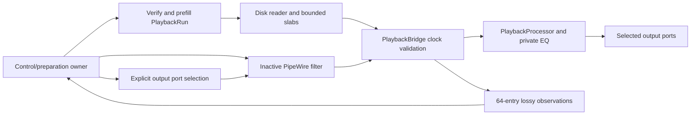

# S6d native playback ownership and clock bridge

**Implemented playback foundation, not GUI playback or full SLICE-001 completion.** The framework-independent `PlaybackBridge` now replaces the native fixture's private clock gate. `SoundCurrent::PipeWirePlayback` is the Linux control/preparation adapter over the existing user daemon and the existing media reader. No new dependency or audio server is introduced.

## Lifetime and data flow

Construction verifies the project/media and prefills off RT, then publishes an inactive zero-input filter with the exact track output count. It waits for its ports with a bounded readiness timeout. The caller inventories ports and supplies every output channel explicitly. Activation before successful route selection is rejected. The existing filter preflight checks node identity/serial, port identity/name/direction and channel count; no default or hardware is chosen automatically. Production playback has `alwaysProcess=false`; the owned test sink supplies activity for qualification.

The owner retains `PlaybackRun`, `PlaybackBridge` and `PipeWireFilter` in lifetime order. All preparation, port inventory, links, activation and destruction belong to one **control/preparation owner**, never a GUI or callback thread. GUI integration must submit through an asynchronous worker; this class does not make its blocking methods asynchronous by itself.

Stop latches the requested terminal state, joins/destroys native callbacks, transfers quiescent ownership, cancels the reader and joins it. Repeated stop/destruction is idempotent. Worker exceptions are retained and surfaced by `checkReader()` after stop; destructors do not throw. A stuck filesystem read or fixture hook is not forcibly killed. The higher-level GUI must stay responsive and show a pending join rather than free callback or worker resources early.

## Clock, output and control semantics

The bridge accepts changing quanta within the prepared bound and checks capacity, exact channel count, rate rational, clock ID, continuity, device-position overflow, xrun and discontinuity before consuming any file frames. Device positions may exceed32 bits; song positions remain the prepared signed session-frame range. Normal advancing native cycles are diagnostic, not preparation generations.

Wholly unmapped, correctly sized initial output blocks retain the prepared start frame without publishing an origin. A partially mapped multichannel block, wrong shape or a missing buffer after startup is a fault. The first valid mapped callback release-publishes an immutable device/time/rate/generation origin. Output slack and terminal/error output are zeroed only within the adapter-certified capacity. An oversized native quantum without certified views cannot be declared successfully silenced.

Terminal states are sticky. A concurrent control fault cannot be overwritten by an audio `Running`, `Underflow` or `Complete` publication, and a completed range remains complete after late route removal. Audio publication uses one strong compare/exchange, with no retry loop; control fault admission may retry outside RT. No object destruction, unbounded queue drain, worker join, allocation/free, GUI work, I/O, logging or blocking lock occurs in the bridge callback. Buffer tokens and bounded parameter prefixes retain their existing RT ownership rules.

The underlying reader/processor still count exact underflow frames and crop the prepared range. `Complete` does not prove zero missing frames; inspect the separate missing counter. Reader failure and processor failure are distinct terminal reasons. Automatic reprepare/resampling/reconnect, seamless seek, general graph/PDC and appended tails remain open.

Immediate controls use the existing bounded S6b ingress and applied-frame receipts. Events after a stopped/terminal owner are rejected. A request admitted concurrently with range completion can still lack an audio receipt; admission must never be presented as applied DSP state. GUI model/revision reconciliation and retry behavior remain the next integration task. `prepared()` is for immutable event preparation, not direct live processor mutation.

One control consumer drains64 immutable native/report observations; full queues drop new summaries and count them. Control meters cannot backpressure playback. Optional callback audit hooks are explicitly RT-only and have caller-owned context that must outlive the owner. Production hooks are empty. `memoryLocked()` remains false.

## Evidence and remaining gates

[Evidence manifest](../tests/results/SLICE-001/2026-10-05-native-playback-owner.json) separates Linux headless tests, owned PipeWire runs, sanitizer diagnostics and Windows compilation. Tests cover clock/rate/quantum/buffer faults, sticky completion/stop, unmapped startup, layouts1/2/8/32/256, lossy-queue overflow, asynchronous reader failure and exact file/offline samples including immediate receipts at a large session start.

The native fixture now uses this production owner rather than its own playback clock checker. It captures ten seconds through an independent owned sink, compares every frame to private offline EQ, rejects stale selection/unrouted activation, removes the sink, checks repeated stop and rejects post-stop edits. The graph harness recognizes both fixture and production-owned node prefixes and verifies existing links/default metadata and final node/link removal. It now retains child diagnostics on timeout; fixture control-side stage messages locate preparation and shutdown boundaries without callback logging.

One run overlapping headless qualification timed out with the previous harness, which discarded child diagnostics. Its location/cause is unknown; overlap is an observation, not a proved explanation. The failed log is retained in evidence. Serial reruns and added stage diagnostics do not establish a deadline/load or bounded native shutdown qualification. Keep that gate open.

Native sanitizer runs retain dependency modules using the existing diagnostic `PIPEWIRE_DLCLOSE=false`; normal PipeWire module-unload memory qualification remains open from S5. No suppression or production environment change is introduced. Owned mono native tests and simulated high-channel layouts do not qualify physical hardware, all native channel layouts, Windows audio, native GUI or full DAW parity.

## Next implementation task

Connect this owner to a separate desktop preparation/transport worker, output selection, Play/Stop and asynchronous close. Bind canonical scalar edits/undo to immediate ingress with accepted/applied revision state, meters and failure presentation. Then add the native recording owner and Arm/Record/Monitor/recovery workflow, S7 transactional export and first-slice end-to-end acceptance. Full frozen reference scope, Windows, all-Europe localization, X004 import and X005 equipment profiling/editor remain required.

S6e has connected this owner to [desktop output selection/playback/live EQ/meters](20-desktop-playback.md). Normal completion retains the silent owner until Stop/reprepare/close for final downstream delivery. Recording ownership/UI and export are next; earlier timeout and qualification limits remain open.
