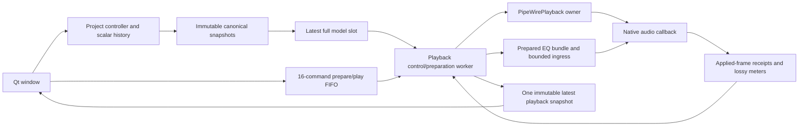

# S6e desktop playback, output selection and live EQ

**Implemented Linux first-track playback preview. Recording/monitoring controls, offline export, full SLICE-001 and frozen full-suite parity remain incomplete.** [Evidence](../tests/results/SLICE-001/2026-10-05-desktop-playback.json) distinguishes injected controller/UI endpoints, real owned PipeWire signals, sanitizers and platform gaps.

## User workflow

Open a project containing a recorded audio clip. Choose **Prepare playback**, then explicitly select a destination for every output channel, and choose **Play**. The range starts at the saved playhead and ends at the first track's last clip. No output is chosen automatically and preparation never activates audio. The existing project editor still creates an empty project; recording/import UI is the next task, so that empty project cannot play yet. The developer recording command supplies a real saved project for current testing.

Frequency, gain and Q edits and scalar undo/redo follow the project controller into the playing EQ. The status distinguishes pending settings from audio-acknowledged settings. Acknowledgment means smoothing began at the recorded sample frame; it does not claim the10ms ramp has settled or prove speaker latency. A colored overall peak meter also displays numeric dBFS, retaining float overs. Red means over0dBFS; it is not a measurement of a hardware converter clipping. Meter display is driven by a16ms GUI timer, independent of the native audio quantum.

**Stop** cancels preparation or stops and joins the active owner on a background worker. At natural range completion the terminal, silent native owner stays connected until Stop, reprepare or close; immediate link destruction could race downstream delivery of the final block. Stop remains enabled for that retained state. Reprepare starts a fresh generation at the saved playhead; this is not seamless seek or a full transport/timeline implementation.

The Transport menu exposes prepare, Space for Play/Stop and Shift+Space for Stop. Output selectors, buttons, sliders and spin boxes have keyboard access and accessible labels. Unfocused wheel movement cannot change route or EQ controls. Scroll/available-screen sizing and scalar gesture undo remain from S6c. User-supplied label text is plain text. Localization contexts and locale numbers are scaffolding; native translations and accessibility/DPI/compositor qualification remain open.

## Ownership and bounded state

Canonical edits/history and project file operations retain the separate S6c control/I/O owners. `PlaybackController` adds one QThread that owns every endpoint method: media verification/prefill, native construction/inventory, explicit links, activation, immutable event preparation/submission, receipt/meter reads and shutdown/destruction. Audio remains the existing framework-independent bridge/processor. No Qt call, virtual endpoint dispatch, allocation/free, file work or blocking lock enters the callback.

Prepare/Play use a16-command FIFO with explicit Full/Closing admission. Stop uses a priority epoch and invalidates queued earlier prepares/plays; close uses a priority flag. A blocked preparation or join cannot make the GUI free resources early. File reads and dependency joins are not forcibly interrupted. Normal window close waits for both project and playback workers before accepting the close; fallback destructors join defensively.

Full canonical models use a **single explicitly coalescing latest slot**. This is an audition transport, not a durable automation recorder: accepted gestures/history are retained by the project controller, but every intermediate GUI-polled model is not promised an audible sample. Stable IDs, same root/project/rate/layout/clip/media/route structure and validation are required. Metadata or structure changes stop this generation and request a new preparation rather than play stale assets. Validation/comparison occurs once per new model revision, with no deep model copy on every2ms worker poll.

Only one EQ bundle is in flight. It contains at most64 changed bands plus enable, and is prepared from the last completely submitted model. A Full DSP queue retains the exact unsubmitted suffix for retry. Partial prefixes do not advance the accepted whole-model revision. Only the receipt covering the last submitted event advances the audio-applied whole-model revision. Newer canonical snapshots wait/coalesce while that bundle completes; the next delta is prepared from the actual submitted model, including undo. Event sequence IDs and preparation generations remain distinct from project model revisions.

While Ready and silent, only the latest canonical model is retained; obsolete edit/undo histories are not prequeued into the audio driver. Play admits the latest delta before activation. Initial settings become acknowledged only after an actual processed block. A numerically unchanged newer model can then share that acknowledgment without inventing an event. Completion racing admission may leave an unapplied revision; the controller does not turn queue admission into an audio acknowledgment.

Native telemetry is drained in bounded64-entry prefixes. Meters/receipts retain drop counters and missing-frame totals. Port inventories refresh on the worker every250ms, using immutable shared vectors; GUI selection survives only an exact identity match. Selected descriptors are rechecked by native route preflight at Play. Stale/missing devices produce a visible fault, never an arbitrary default reconnection. Route selection is currently ephemeral and is not persisted into the project schema.

## Verification and limits

Controller fixtures use explicitly injected, synthetic endpoints. They exercise Full/retry, a partially admitted two-band bundle, latest-model reconciliation, accepted versus applied revisions, equivalent/undo-like models, silent preparation, generation replacement, structural mismatch, device loss, empty ranges, full FIFO and priority close during blocked preparation. They do not qualify native audio.

Offscreen UI fixtures additionally exercise actual Prepare/Play/Stop buttons, explicit output selection, colored/numbered meters, live scalar undo and a close held at a worker join while the window remains responsive. An initial fixture crash held a stale/null combo pointer across asynchronous row rebuilding; its debugger trace is preserved, and the fixture now waits for/reacquires rendered controls. No native application crash is inferred from that fixture error.

The separate native fixture drives the actual Qt window and production worker, selects an owned sink, captures ten seconds, applies gain and keyboard undo, replays exact receipt frames through private offline EQ, and compares every captured sample. It also removes the selected output and tests asynchronous close/Discard without changing the saved project. Callback allocation/free/direct mutex audits, independently sampled graph/default preservation and final owned-node/link removal are recorded. No physical speaker/microphone route is opened.

Native sanitizer runs use the existing retained-module diagnostic `PIPEWIRE_DLCLOSE=false`; normal module-unload memory qualification remains open. S6d's earlier unexplained native timeout is not resolved by these serial runs. No real hardware latency/deadline/load, all native channel layouts, native compositor/accessibility or Windows GUI/audio execution is claimed. The shared headless Windows regression build passes; the new Qt worker/window is not yet Windows-qualified. Builds without the native adapter show playback unavailable; desktop now requires the media target.

## Next task

Add the recording preparation/transport owner and GUI input selection, Arm/Record/Stop and monitoring modes, raw take attachment and recoverable fault/recovery presentation. Keep capture/finalization off GUI and callback owners, and test owned sources/sinks before physical input. Then implement S7 transactional offline export and qualify the complete record/EQ/save/reopen/export slice. Full frozen parity, Windows, all-Europe localization, X004 imports and X005 equipment profiling/editor remain required.
