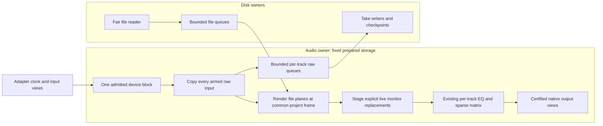

# M2d1: one admitted clock for playback and armed raw capture

`DuplexBridge` prepares explicit stable-ID armed-track bindings to caller-owned
raw `CapturePipe` instances, packed native input-plane indices and Off/Post-EQ
monitoring. Its one audio owner admits one device block before either operation.
The shared `MixPlaybackRun` remains the playback cursor/graph/read-ahead owner;
all capture packets use that same signed project frame. The first valid device
block publishes the same immutable origin to every raw take. Large device
positions, advancing cycles and diagnostic driver delay are not project offsets
or measured input latency.

Preparation validates project state, track/pipe identity and uniqueness, layouts,
rates, common start, callback capacities, input mappings and monitoring mode.
Post-EQ monitoring requires an explicit compatible lane in the prepared matrix.
Current bounds are 256 armed tracks and 256 packed native input planes, subject
to the existing session/layout/matrix limits and an aggregate 256-MiB maximum
payload budget. Conservative admission reserves the prepared run's declared
playback budget and adds raw pools plus metadata allowance; it is not an allocator/RSS guarantee. The
bridge borrows already prepared buffers. The future native owner must preflight
their combined memory before allocating all pools, rather than relying on late
bridge rejection after caller allocation.

No GUI, file work, allocation, blocking locks or logging enters `process()`.
Input-pointer scratch and live-lane bindings are prepared off RT. Bounded raw
copies precede all EQ/matrix writes, including in-place native input/output
views. Output planes must be independent; duplicate output pointers are refused
before file/capture consumption. Backing capacities/nonoverlapping output planes
remain the adapter's contract. Destruction, reader/disk joins and model admission
belong to control after native callback shutdown transfers ownership.

## Monitoring and rendering

`MixPlayback`/`MixPlaybackRun` now accept optional prepared-ordinal live input
replacements. Empty replacements retain the existing playback/offline behavior.
Each replacement has exactly one compatible channel span; duplicate/unknown
lanes, wrong shape and null pointers are refused before consuming file pipes.
Live samples are copied into the lane's existing prepared raw scratch, then pass
through its existing EQ, event queues/receipts and sparse matrix.

For armed Post-EQ monitoring, the live signal replaces that track's file signal
for this recording generation. Off records its raw input while leaving file
playback unchanged. Other tracks continue playing files. This explicitly defined
mode is not Auto/tape monitoring or punch/loop switching; those remain required.
Underlying file pipes still advance and retain their failure/underflow accounting,
even for a replaced lane. Audible live input does not hide a reader gap. No room
correction, microphone profile or monitor processing is printed into raw takes.
The ordinary offline renderer has no live replacements.

## Boundaries and failures

Rate/quantum/clock/ID/flag/buffer failures stop the generation, silence certified
outputs and leave both cursors/capture prefixes unchanged for that invalid block.
Entirely unmapped, correctly sized startup can be skipped; partially mapped
startup is a fault. A valid final native block is shortened for both the graph
and raw takes to the requested project end; capacity slack is silent.

Each raw lane exposes its actual accepted frame count. If a writer/pool fails,
the admitted block can leave different valid raw prefixes: earlier lanes may
accept it fully, while a full pool accepts only its remaining capacity. All lanes
are attempted once, then the generation stops without advancing the graph for
that failed capture block. Accepted raw samples are retained, rejected frames
are counted and the first failed lane is reported; no rollback or fictitious
common length is inferred. Likewise a playback/DSP failure after raw publication
can preserve a last raw block without advancing playback. Journal termination
and the richer duplex diagnostic must be interpreted together. Reader failure
currently uses the generic processor-failure journal reason; its distinct cause
remains in the duplex record. A journal-level playback-failure cause is a later
compatibility task.

First winning terminal status is sticky. Callback failure facts contain received/
previous clocks, prior admission, generation, engine position, expected rate/
quantum/input/output shapes, capacity and failed capture ordinal. They publish
once independently of the lossy 64-slot observation queue. Control-originated
Stop/device failure does not fabricate a callback clock. Control fault requests
can retry an atomic comparison off RT while Running/Underflow alternates; the
callback itself performs one bounded terminal comparison. Stop/join must precede
`finishQuiescent()` and disk finalization/recovery.

## Evidence and next native workflow

[Checkpoint evidence](../tests/results/M2/2026-10-06-shared-playback-capture.json)
separates the new backend-free bridge from existing native regression coverage.
The new corpus includes:

- 33 mixed lanes with 32 simultaneously armed mono tracks, permuted input maps,
  stereo sparse output, aliased input/output views, variable 37/127/256/83-frame
  blocks, a partial final block and an independent float64 matrix/sample oracle.
- Exactly 9,866 raw frames per armed take beginning at project frame 137; samples
  above unity are preserved, NaN input is counted/sanitized and all raw files are
  compared independently. Saved clips verify supplied 41/200-frame alignment,
  initial trimming and save/reopen without changing previous media/project state.
- Fourteen clock/buffer/control faults, malformed preparation/shape/duplicates,
  empty versus partial priming, full meter queue, unequal queue-full prefixes and
  an injected writer-failed latch with exact rejected counts/reasons and retained
  first facts.
- Concurrent disk workers: 6-dB known 1-kHz peaking response, immediate monitor EQ
  change/receipt, analytically checked settled output, and identical raw Off/
  Post-EQ recordings.
- Interrupted unfinished mono/stereo writers, exclusive inactive inspection,
  verified 4,096-frame recovery copies with original files unchanged, channel
  order/common origin/alignment, then attachment and save/reopen.
- Existing shared/offline/native playback regression and platform builds, with
  callback audit observations reported in their actual scope.

This finite corpus is not M2's ten-minute synthetic/30-minute native acceptance,
hardware latency, PDC, native Windows, process-kill/disk-full multitrack recovery,
native callback deadlines or a desktop simultaneous-recording workflow.

**Next:** implement a production PipeWire duplex owner around this bridge, with
preflight memory/spec admission, inactive explicitly selected input/master ports,
writer creation only on activation, activation rollback, callback stop/join before
pipe/disk finalization and independently retained per-track results/errors. Add
owned source → duplex → sink tests for simultaneous playback/raw capture,
disconnect, activation/writer failure, recovery and exact sample alignment. Then
connect armed-track selection, monitoring and grouped verified take handoff to
the desktop worker/history. Investigate the retained historical native and
intermittent UI failures under declared load. Auto monitoring, punch/loop/takes/
comping, buses/PDC and all frozen F/Q/C/N/X004/X005/platform/localization workflows
remain required. Equalizer checkouts remain untouched; no new dependency or
publication is implied.

## M2d2 follow-up

[Production ownership](36-duplex-recording-owner.md) now performs aggregate capture
admission before allocation and owns native preparation/activation/join plus
independent disk receipts/errors/recovery. The M2d1 evidence above remains scoped
to its original bridge checkpoint; native M2d2 qualification is separate.
